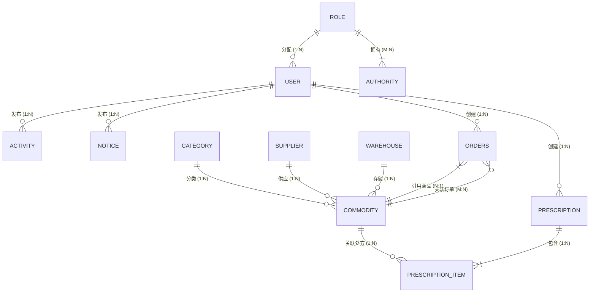

```mermaid
erDiagram
    USER ||--o{ ACTIVITY : "发布 (1:N)"
    USER ||--o{ NOTICE : "发布 (1:N)"
    USER ||--o{ ORDERS : "创建 (1:N)"
    USER ||--o{ PRESCRIPTION : "创建 (1:N)"
    ROLE ||--o{ USER : "分配 (1:N)"
    ROLE ||--|{ AUTHORITY : "拥有 (M:N)"
    CATEGORY ||--o{ COMMODITY : "分类 (1:N)"
    SUPPLIER ||--o{ COMMODITY : "供应 (1:N)"
    WAREHOUSE ||--o{ COMMODITY : "存储 (1:N)"
    COMMODITY ||--o{ ORDERS : "关联订单 (M:N)"
    COMMODITY ||--o{ PRESCRIPTION_ITEM : "关联处方 (1:N)"
    PRESCRIPTION ||--|{ PRESCRIPTION_ITEM : "包含 (1:N)"
    ORDERS }|--|| COMMODITY : "引用商品 (N:1)"
```