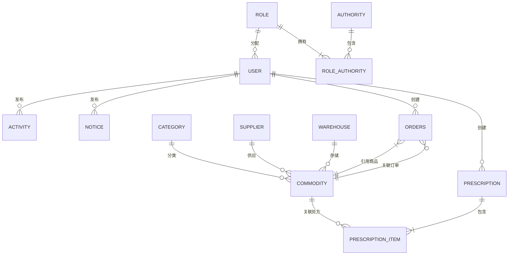

```mermaid
erDiagram
    USER ||--o{ ACTIVITY : "发布"
    USER ||--o{ NOTICE : "发布"
    USER ||--o{ ORDERS : "创建"
    USER ||--o{ PRESCRIPTION : "创建"
    ROLE ||--o{ USER : "分配"
    ROLE ||--|{ ROLE_AUTHORITY : "拥有"
    AUTHORITY ||--o{ ROLE_AUTHORITY : "包含"
    CATEGORY ||--o{ COMMODITY : "分类"
    SUPPLIER ||--o{ COMMODITY : "供应"
    WAREHOUSE ||--o{ COMMODITY : "存储"
    COMMODITY ||--o{ ORDERS : "关联订单"
    COMMODITY ||--o{ PRESCRIPTION_ITEM : "关联处方"
    PRESCRIPTION ||--|{ PRESCRIPTION_ITEM : "包含"
    ORDERS }|--|| COMMODITY : "引用商品"
```